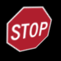
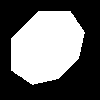
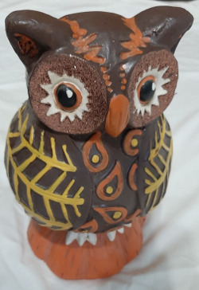
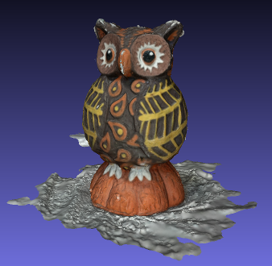
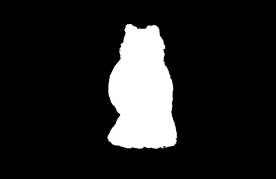
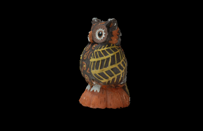
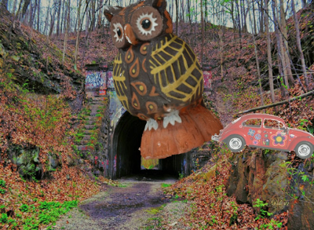

# Synthetic Data for Training Vision Detectors

This is a modification and extension of:  
https://github.com/debidatta/syndata-generation
 
The programs were tested in Ubuntu 18.04.

## requirements

**General**  

1. OpenCV (pip install opencv-python)  
2. PIL (pip install Pillow)  
3. Poisson Blending (Follow instructions [here](https://github.com/yskmt/pb)  
4. PyBlur (pip install pyblur)

**Making 3D models:**  

1. Colmap - documentation and installation instruction: [https://colmap.github.io/](https://colmap.github.io/)   
2. meshlab -[ https://www.meshlab.net/](https://www.meshlab.net)  
3. cloudcompare - [https://www.danielgm.net/cc/](https://www.danielgm.net/cc/)

## Introduction
This method creates synthetic data by pasting objects on top of background images. The only requirement of the background images is that they do not contain the objects. The objects are presented as an image containing the object and a mask that covers the parts of the image that is not the object. We will first discuss how to get the objects and masks and then explain how to paste it onto the background.  

## objects and masks

The input to the syntheic data generator are images of the objects and corresponding masks. We will describe three different methods to obtain them:  grabcut, creating from 2D objects, and creating from 3D objets.

### grabcut

The original program and documentation can be found in opencv: [grabcut](https://docs.opencv.org/master/d8/d83/tutorial_py_grabcut.html)  
A modified version can be found at `tools/grabcut_new.py`. The original program crashed.   
The program takes an image and with some user input it separates the forground object from the background. An example result (from the documentation):

### creating from 2D objects

Examples of 2D objects are traffic signs, they have only significant extensions in two dimentions. A Stop sign images is in the directory `traffic_sign`. Note that areas in the image that are not part of the stop sign have a transparency of 1.  To separate this RGBA image into a RGB image and a mask in our format, use:  

   `python3 RGBA2RGB_mask.py inputDir outputDir`

where `inputDir` contains the RGBA image and the resulting RGB image and mask are saved in `outputDir`

Since the object is effectively 2D, a rotation in 3D space is an afine transformation in the image. A new set of images where the object is rotated around the x and y axis can be created with:

`python3 perspective_warp.py image_basename` 

Here is one example result, a roated stop sign and the corresponding mask:

### creating from 3D objects

The 3D objects can come from an existing mesh, a CAD model, or from an object at hand. The mesh model can be used directly. The CAD model needs to be converted to *.ply or similar file format that can be read into CloudCompare. A mesh can be created from a real object by taking pictures of it and using the SfM program Colmap. 

Here are the steps to create a mesh starting from a real object:

1. Take pictures of the objects from all sides. An example set of images of an owl is in `make3D/images`. 

2. Use Colmap to to create a mesh model. The set of commands you need are in the script `make3D/make_dense`. The result is:  
    
Use CloudCompare to remove extraneous parts of the mesh. Note that it is in gerneral difficult to get a nice 3D mesh from pictures, don't be surprised if the script does not give a good result the first time you try it with your own pictures. Even the reconstruction shown here has some errors, e.g. there are white areas on the beak and ears of the owl. To get a better model one has to clean the dense point cloud and create the mesh e.g. by using meshlab. 

3. Open the cleaned mesh in CouldCompare and take snapshots of it from different angles with white background. A convenient way to create a lot of the snapshots in a systematic way is to use the the video function in CloudCompare. 

 4. Describe the path you want the camera to take by setting different viewpoints. Space the viewpoints uniformally. You move the object to each viewpoint and save it  *Display* -> *save viewpoint as object*

 5. HIghlight all the saved viewpoints and click *plugin* -> *animation*. Make sure that superresolution=1. Choose duration and framerate to determine how many frames you want between the viewpoints. Choose the output file, that is the directory where the frames will be saved to. Next click *Export frames*. 

6. Run the python script  
`python3 tools/im2mask.py  1  inputDir  outputDir`   
It creates the mask by considering all the white pixels as background. It also creates a new image where all the background is black.  

  
 

## Generating dataset

Changes from the original:  
 - works with python3  
 - the gaussian or box blending are now random numbers  
 - randomly selected jpg compression  
 - pasting the objects is done with transparency, gives more acurate results on the edges of the object   

The python script `dataset_generator.py` creates the  dataset. As example we have the object in `root`, the background in `background` and the distractor objects in `distractor`.  When you run it like this:

`python3 dataset_generator.py --scale --rotation --num 1 --add_distractors root train_out`  

you will get the resulting training data in `train_out` and a label file `train_out.txt`. The training images are in `train_out/images`, the format labels in simple ASCII is:

<pre>
path/to/image,xmin,ymin,xmax,ymax

train_out/images/1_gaussian.jpg,333,1,730,525,owl
train_out/images/1_poisson.jpg,333,1,730,525,owl
train_out/images/1_none.jpg,333,1,730,525,owl
train_out/images/1_box.jpg,333,1,730,525,owl
train_out/images/1_motion.jpg,333,1,730,525,owl
</pre>

Additionally there are the labels and annotations in `*.txt` and `*.xml` files. 

Some of the options can be choosen as arguments:
<pre>
usage: dataset_generator.py [-h] [--selected] [--scale] [--rotation]  
                            [ --num NUM] [--dontocclude] [--add_distractors]  
                            root exp
</pre>

most of the options and parameters are in default.py, e.g. the path to the background and to the distractors. 

An example output image is (note the Beetle as a distractor):

  

-selected] [--scale] [--rotation]  
                            [ --num NUM] [--dontocclude] [--add_distractors]  
                            root exp
</pre>

most of the options and parameters are in default.py, e.g. the path to the background and to the distractors. 

An example output image is (note the Beetle as a distractor):

  
